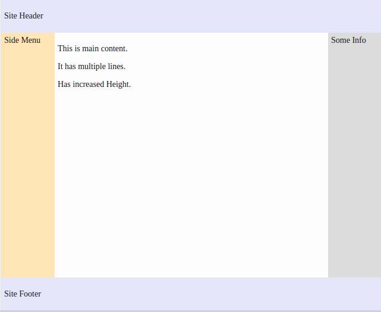

##Exercise - Holy Grail Layout

##Description
Holy Grail Layout is a superset of some of the commonly used layouts found.
It consists of a header, a footer and a main content area with a left 
sidebar (let's say for side menu) and a right sidebar (let's say for some additional info).
While there are few [well known solutions](http://alistapart.com/article/holygrail) it was still a difficult layout to create simply in CSS without any hacks.

Here we have a ***header*** and ***footer*** at the top and the bottom respectively.
In-between we have a container, containing the main content (having ***content*** class)
 with side menu on the left (having ***side-menu*** class) and an info panel on the right (having ***side-info*** class).

Aim of this exercise is to create the holy grail layout so that:-
* Main content has fluid width with fixed-width sidebars.
* Main content and the side bars should form three equal height columns.
    * Assume the fixed width to be 80px for both.
* The footer should “stick” to the bottom of the page when content is sparse.
* The layout should be responsive and the sections should collapse into one column on smaller viewports. 
    * Assume breakpoint to be 500px.

The final page should resemble :-

* For large screens 
 
 

 
* For small screens

  
