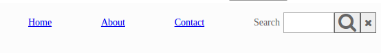

##Exercise - Navigation Bar

##Description
Flex box allows us to easily layout multiple elements in a row with required spacing and alignment.
This is quite helpful while creating navigation bars with multiple elements aligned horizontally.

Aim of this exercise is to create the navigation bar using css so that:-
* All navigation elements including the search box elements are vertically centered.
* Horizontal white space is distributed equally inside the navigation bar.
* Icons after the search element should appended to the search field.

The final page should resemble :-

 
