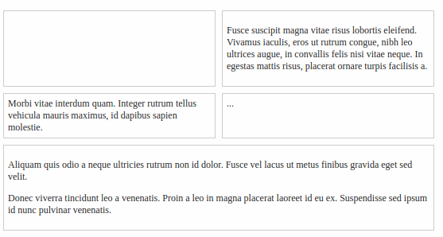

#Exercise - Grid which fills up available space

##Description
Flexbox enables the creation of flexible and responsive grids quite easily. 
This problem tries to demonstrate that by creating a simple grid.

The grid should be created by changing the css so that:-
* Each row in the grid has no more than two elements.
* All the elements in a row have equal width.
* Elements should stretch to fill up the available space.

The final page should resemble :-

 
